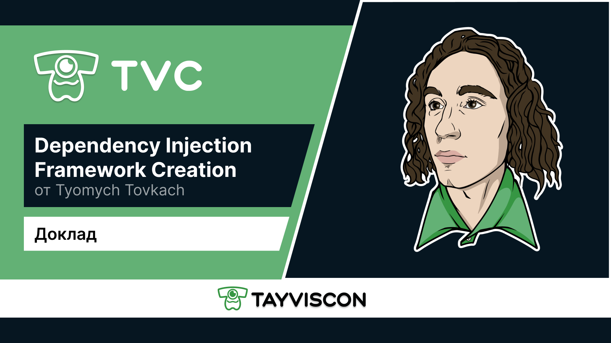

# Разработка фреймворка, использующего внедрение зависимостей в качестве реализации принципа инверсии управления


***Примечание* - В этом докладе, мы рассмотрим подход к построению современных фреймворков, использующих внедрение
зависимостей, чтобы сформировать понимание основных концепции инверсии контроля и способов кастомизации. Для того чтобы
ответить на все эти вопросы, мы будем писать приложение согласно поставленной бизнес-задаче. Однако для того, чтобы
написать красивый код, в процессе разработки у нас возникнет необходимость создать инфраструктуру, которая позволит
сделать наш код более гибким и будет соблюдать все правила SOLID. Именно в процессе написания и развития этой
инфраструктуры, которая будет подгоняться под нашу бизнес-задачу, у нас появится некий аналог современных фреймворков,
использующих внедрение зависимостей в качестве реализации принципа инверсии контроля.**

## 1. ВВЕДЕНИЕ

### ОПИСАНИЕ РЕШАЕМОЙ БИЗНЕС-ЗАДАЧИ
```
Компания "ЭкзаменаНет" разместила заказ на разработку сервиса, помогающего студентам списывать на экзаменах. На
данный момент аналитики компании находятся в процессе проработки требований, а от компании-подрядчика, которая
возьмется за выполнение данного заказа, требуется разработать простейший прототип приложения.

После многочасовых (и пока что бесполезных) совещаний аналитики решили, что для каждого студента и преподавателя
необходимо хранить следующие свойства:

    1. Уникальный идентификатор;
    2. Фамилию;
    3. Имя;
    4. Отчество;
    5. Дополнительные сведения.
    
Горе аналитики - не единственная беда компании-заказчика. Дело в том, что на текущий момент не выделен бюджет под
проработку сценариев, направленных на отвлечение внимания преподавателей, но уже сейчас можно сказать, что их будет
несколько. 

Формально требуется:
    1. Разработать объектную модель по требованиям заказчика; 
    2. Реализовать инфраструктуру приложения, способную гибко расширяться при появлении новых сценариев. 
```

### ОПИСАНИЕ ИНСТУРМЕНТАЛЬНЫХ СРЕДСТВ, ВЫБРАННЫХ ДЛЯ РЕШЕНИЯ ЗАДАЧИ

Разработку сервиса мы будем осуществлять с помощью языка программирования `JAVA`, а для сборки проекта использовать
`MAVEN`. Информацию о конфигурации и деталях проекта можно увидеть в [pom.xml](/exam-cheating-service/pom.xml) файле.
Отдельное внимание необходимо уделить сторонним зависимостям, которые мы будем использовать для решения задачи:
* `lombok` - это библиотека для сокращения кода в классах и расширения функциональности языка Java;
* `jsr250-api` - запрос спецификации Java, целью которого является разработка аннотаций для общих семантических 
концепций для платформы Java EE и Java SE (различные JSR используют аннотации для предоставления декларативного стиля
программирования);
* `reflections` - библиотека, расширяющая возможности стандартного Reflection API.

### ИНИЦИАЛИЗАЦИЯ ПРОЕКТА

Работу над реализацией проекта начнем с объявления объектной модели:

* Класс [Student](/exam-cheating-service/src/main/java/ru/tayviscon/knowledge/base/domain/model/Student.java) - модель студента;
* Класс [Teacher](/exam-cheating-service/src/main/java/ru/tayviscon/knowledge/base/domain/model/Teacher.java) - модель преподавателя;

Также давайте объявим класс [ExamCheatingService](/exam-cheating-service/src/main/java/ru/tayviscon/knowledge/base/service/ExamCheatingService.java),
который представляет собой сервис, помогающий студентам списывать на экзамене:

```java
/**
 * Сервис, помогающий студентам списывать на экзамене.
 *
 * @author Tyomych Tovkach
 */
public class ExamCheatingService {

    /**
     * Основной метод сервиса.
     *
     * @param teacher  преподаватель, которого необходимо отвлечь.
     * @param students студенты, которым необходимо разослать ответы.
     */
    public void start(Teacher teacher, List<Student> students) {
        // todo отвлечь преподавателя
        // todo разослать студентам ответы
    }

}

```

Таким образом, данный сервис должен сначала отвлечь внимание преподавателя, а затем разослать студентам ответы.